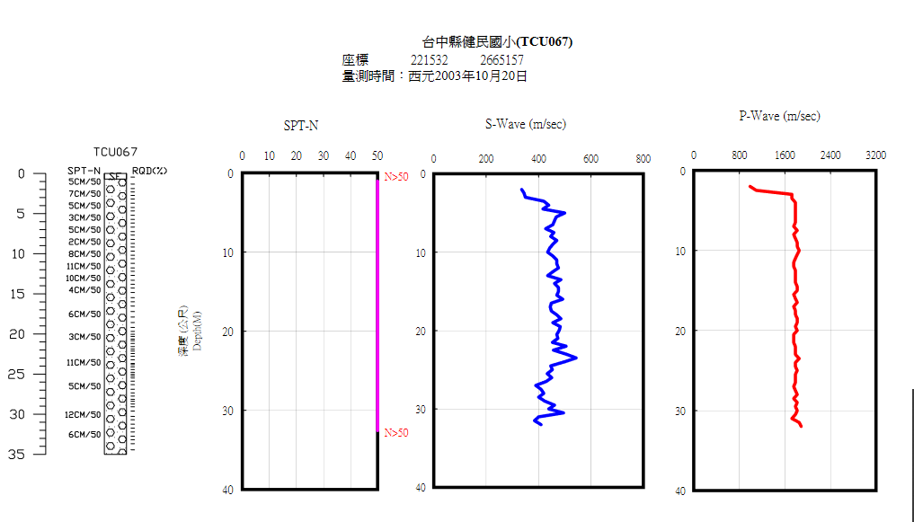

[TOC]

# 地震工程實務分析期末作業
107682001 吳宗羲

### 基本資訊
#### 回歸期公式
$$
R = T/\log(1-P(Z>z))
$$

#### 設計地震
- 容許塑性變形但韌性需求不得超過容許韌性容量
- $T=50$ 年內超越機率$P>10\%$；即回歸期$R\approx 475$ 年 (474.56年)

#### 最大考量地震
- 使用之韌性可達規定之韌性容量
- $T=50$ 年內超越機率$P>2\%$；即回歸期$R\approx 2500$ 年 (2474.92年)

### (Step 1) 依據工址位置查表得到震區水平譜加速度係數
#### 工址

#### 工址放大係數

### (Step 2) 近斷層調整因子

### (Step 3) 決定工址放大係數
#### 地盤分類

$V_{S30}$ 的計算方法：

$$
V_{S30} = \frac{\sum_{i=1}^n d_i}{\sum_{i=1}^n d_i/V_{Si}}
$$

來源：

得到工址放大係數

### (Step 4) 計算工址水平譜加速度係數
根據以上，我們可以得到近斷層區域工址短周期($S_{DS}$)及一秒週期設計水平譜加速度係數($S_{D1}$)

設計地震：
$$
S_{DS} = S_S^D F_a N_A\\
S_{D1} = S_1^D F_v N_V \\
T_0^D = \frac{S_{D1}}{S_{DS}}
$$

最大考量地震：
$$
S_{MS} = S_S^M F_a N_A\\
S_{M1} = S_1^M F_v N_V  \\
T_0^M = \frac{S_{M1}}{S_{MS}}
$$

以及工址短週期($S_{MS}$)及一秒週期最大考量水平譜加速度係數($S_{M1}$)

### 反應譜圖

### 結果對照

